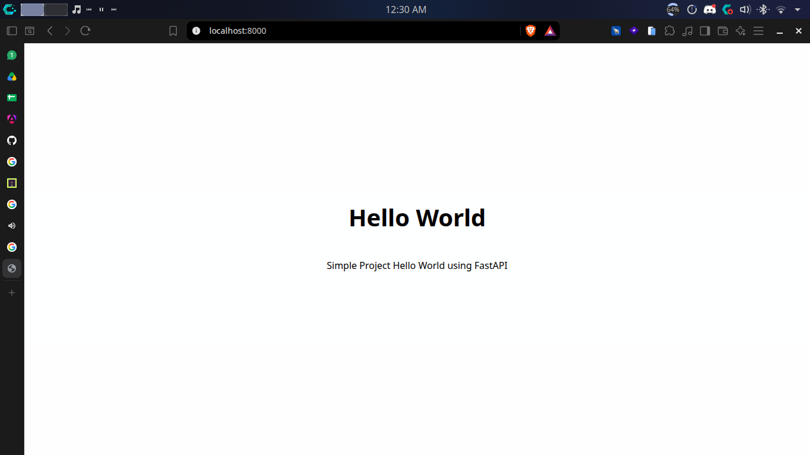
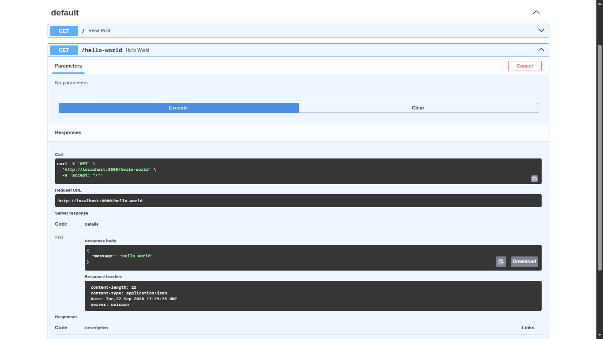

# PBL0101 - Hello World FastAPI

Program Sederhana Hello World menggunakan framework **FastAPI** dengan basis bahasa pemrograman python

```
Nama: M. Sobahus Sururin Ni'am
NIM: 054
```




</br>

## Running Program

## Tools

- **Python**: Version `3.12`
- **Package Manager**: [uv](https://docs.astral.sh/uv/) or `pip` standar

---

### Option 1: `uv`

1. **Sync & install dependencies**:

   ```bash
   uv sync
   ```

2. **Run**:
   ```bash
   uv run uvicorn app.main:app --reload
   ```

### Option 2: `pip`

1. **Virtual Environtment**:
   - **Linux / macOS**:
     ```bash
     python3 -m venv .venv
     source .venv/bin/activate
     ```
   - **Windows (Command Prompt / PowerShell)**:
     ```cmd
     python -m venv .venv
     .venv\Scripts\activate
     ```

2. **Install Dependensi**:

   ```bash
   pip install -r requirements.txt
   ```

3. **Run**:
   ```bash
   fastapi dev app/main.py
   ```

## Localhost Access

- **Main Page**: [http://127.0.0.1:8000/](http://127.0.0.1:8000/)
- **Swagger Documentation**: [http://127.0.0.1:8000/docs](http://127.0.0.1:8000/docs)

## Dependency

- `fastapi[standard]`: Framework web modern berkinerja tinggi, mencakup `uvicorn` dan tools CLI bawaan.
- `jinja2`: Template engine untuk me-render file HTML dinamis.
